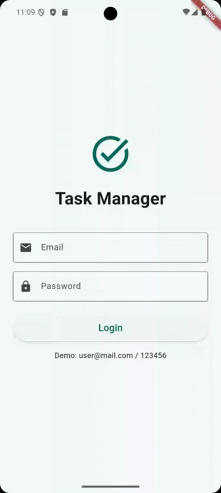
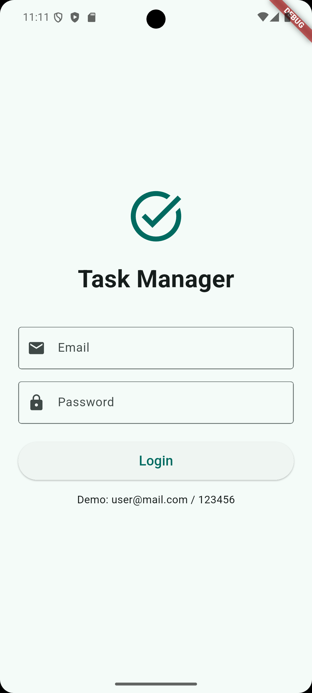
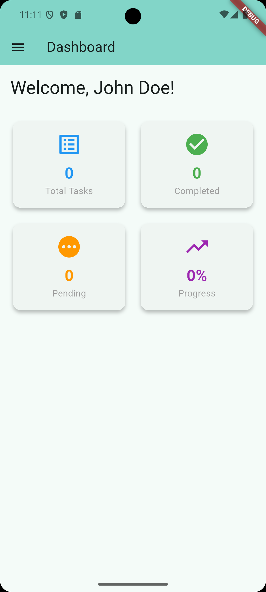
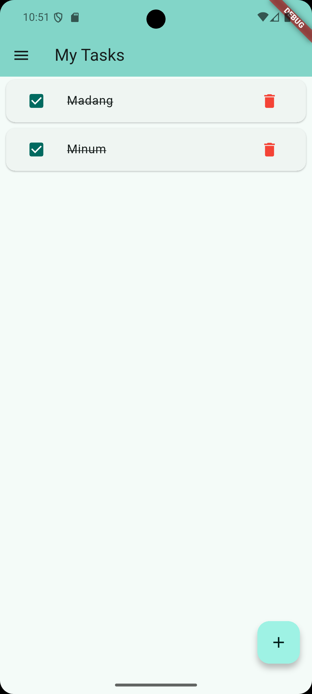
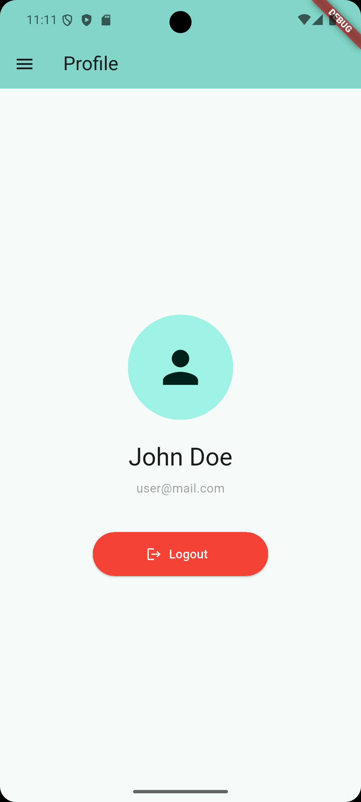
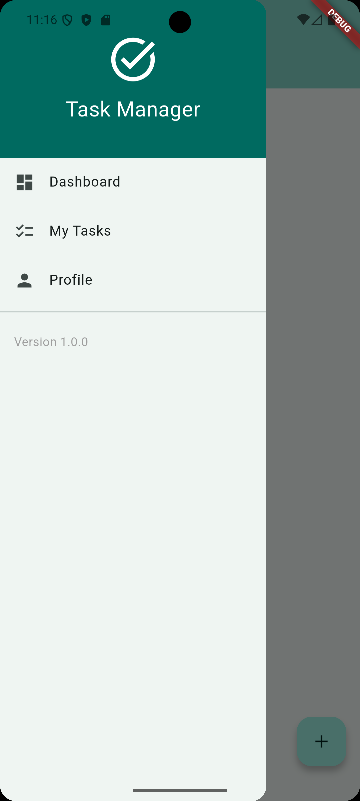

# Task Manager App | Tugas 7 - Pertemuan 9

Aplikasi Task Manager sederhana yang dibangun menggunakan Flutter dengan fitur autentikasi, manajemen tugas, dan persistensi data menggunakan SharedPreferences.

## Fitur Aplikasi

- Login & Authentication
- Dashboard dengan statistik tugas
- Manajemen tugas (Create, Read, Update, Delete)
- Profil pengguna
- Persistensi data dengan SharedPreferences
- Navigation Drawer untuk navigasi antar halaman

## Demo Aplikasi



1. Login Screen
2. Dashboard Screen
3. Tasks Screen
4. Profile Screen
5. Navigation Drawer

## Struktur Project

```
lib/
├── main.dart                 # Entry point aplikasi
├── screens/
│   ├── login_screen.dart     # Halaman login
│   ├── dashboard_screen.dart # Halaman dashboard
│   ├── tasks_screen.dart     # Halaman manajemen tugas
│   └── profile_screen.dart   # Halaman profil
└── widgets/
    └── app_drawer.dart       # Navigation drawer widget
```

## Penjelasan Kode

### 1. Main.dart

```dart
void main() {
  runApp(const MyApp());
}
```

- Entry point aplikasi yang menjalankan widget `MyApp`

```dart
MaterialApp(
  title: 'Task Manager',
  theme: ThemeData(
    colorScheme: ColorScheme.fromSeed(seedColor: Colors.deepPurple),
    useMaterial3: true,
  ),
  initialRoute: '/login',
  routes: {
    '/login': (context) => const LoginScreen(),
    '/dashboard': (context) => const DashboardScreen(),
    '/tasks': (context) => const TasksScreen(),
    '/profile': (context) => const ProfileScreen(),
  },
)
```

- Konfigurasi routing aplikasi dengan named routes
- Theme menggunakan Material 3 dengan warna deepPurple
- Initial route dimulai dari halaman login

### 2. Login Screen (login_screen.dart)



#### a. Form Validation

```dart
final _formKey = GlobalKey<FormState>();
final _emailController = TextEditingController();
final _passwordController = TextEditingController();
```

- `GlobalKey<FormState>` untuk validasi form
- TextEditingController untuk mengelola input text

#### b. Check Login Status

```dart
Future<void> _checkLoginStatus() async {
  final prefs = await SharedPreferences.getInstance();
  final isLoggedIn = prefs.getBool('isLoggedIn') ?? false;
  if (isLoggedIn && mounted) {
    Navigator.pushReplacementNamed(context, '/dashboard');
  }
}
```

- Mengecek status login saat aplikasi dibuka
- Jika sudah login, redirect ke dashboard
- `mounted` memastikan widget masih aktif sebelum navigasi

#### c. Login Logic

```dart
Future<void> _login() async {
  if (_formKey.currentState!.validate()) {
    setState(() => _isLoading = true);

    if (_emailController.text == 'user@mail.com' &&
        _passwordController.text == '123456') {
      final prefs = await SharedPreferences.getInstance();
      await prefs.setBool('isLoggedIn', true);
      await prefs.setString('userEmail', _emailController.text);
      await prefs.setString('userName', 'John Doe');

      Navigator.pushReplacementNamed(context, '/dashboard');
    }
  }
}
```

- Validasi input menggunakan form key
- Hard-coded credentials untuk demo
- Menyimpan data login ke SharedPreferences
- Loading state untuk UX yang lebih baik

### 3. Dashboard Screen (dashboard_screen.dart)



#### a. Load Data dari SharedPreferences

```dart
Future<void> _loadData() async {
  final prefs = await SharedPreferences.getInstance();
  setState(() {
    _userName = prefs.getString('userName') ?? 'User';
    _totalTasks = prefs.getInt('totalTasks') ?? 0;
    _completedTasks = prefs.getInt('completedTasks') ?? 0;
  });
}
```

- Membaca data user dan statistik tugas
- Menggunakan operator `??` untuk default value

#### b. Stat Card Widget

```dart
Widget _buildStatCard(String title, String value, IconData icon, Color color) {
  return Card(
    elevation: 4,
    child: Padding(
      padding: const EdgeInsets.all(16.0),
      child: Column(
        children: [
          Icon(icon, size: 40, color: color),
          Text(value, style: TextStyle(fontSize: 24, fontWeight: FontWeight.bold)),
          Text(title, style: const TextStyle(color: Colors.grey)),
        ],
      ),
    ),
  );
}
```

- Reusable widget untuk menampilkan statistik
- Menggunakan Card dengan elevation untuk visual depth
- Parameter fleksibel untuk berbagai jenis statistik

#### c. Progress Calculation

```dart
_totalTasks > 0
  ? '${((_completedTasks / _totalTasks) * 100).toStringAsFixed(0)}%'
  : '0%'
```

- Menghitung persentase tugas yang selesai
- Menghindari division by zero dengan ternary operator

### 4. Tasks Screen (tasks_screen.dart)



#### a. Task Data Structure

```dart
List<Map<String, dynamic>> _tasks = [];
```

- Menyimpan tugas sebagai List of Maps
- Setiap task memiliki 'title' dan 'completed'

#### b. Load Tasks dari Storage

```dart
Future<void> _loadTasks() async {
  final prefs = await SharedPreferences.getInstance();
  final taskList = prefs.getStringList('tasks') ?? [];
  setState(() {
    _tasks = taskList.map((task) {
      final parts = task.split('|');
      return <String, dynamic>{
        'title': parts[0],
        'completed': parts[1] == 'true',
      };
    }).toList();
  });
}
```

- Membaca tasks dari SharedPreferences
- String format: "title|completed"
- Parsing string ke Map dengan explicit typing `<String, dynamic>`

#### c. Save Tasks ke Storage

```dart
Future<void> _saveTasks() async {
  final prefs = await SharedPreferences.getInstance();
  final taskList = _tasks.map((task) {
    return '${task['title']}|${task['completed']}';
  }).toList();
  await prefs.setStringList('tasks', taskList);
  await prefs.setInt('totalTasks', _tasks.length);
  await prefs.setInt('completedTasks',
    _tasks.where((task) => task['completed'] == true).length);
}
```

- Convert Map ke String format
- Menyimpan sebagai StringList di SharedPreferences
- Update statistik untuk dashboard

#### d. Add Task

```dart
void _addTask() {
  if (_taskController.text.isNotEmpty) {
    setState(() {
      _tasks.add(<String, dynamic>{
        'title': _taskController.text,
        'completed': false,
      });
      _taskController.clear();
    });
    _saveTasks();
    Navigator.pop(context);
  }
}
```

- Validasi input tidak kosong
- Explicit type `<String, dynamic>` untuk menghindari type error
- Clear controller setelah add
- Save dan close dialog

#### e. Toggle Task Completion

```dart
void _toggleTask(int index) {
  setState(() {
    _tasks[index]['completed'] = !(_tasks[index]['completed'] as bool);
  });
  _saveTasks();
}
```

- Toggle status completed
- Type casting `as bool` untuk type safety
- Update storage setelah perubahan

#### f. ListView Builder

```dart
ListView.builder(
  itemCount: _tasks.length,
  itemBuilder: (context, index) {
    final task = _tasks[index];
    return Card(
      child: ListTile(
        leading: Checkbox(
          value: task['completed'] as bool,
          onChanged: (_) => _toggleTask(index),
        ),
        title: Text(
          task['title'] as String,
          style: TextStyle(
            decoration: (task['completed'] as bool)
                ? TextDecoration.lineThrough
                : null,
          ),
        ),
        trailing: IconButton(
          icon: const Icon(Icons.delete, color: Colors.red),
          onPressed: () => _deleteTask(index),
        ),
      ),
    );
  },
)
```

- Efficient list rendering dengan builder
- Checkbox untuk toggle completion
- Strikethrough text untuk completed tasks
- Delete button di trailing

### 5. Profile Screen (profile_screen.dart)



#### a. Logout Function

```dart
Future<void> _logout() async {
  final prefs = await SharedPreferences.getInstance();
  await prefs.clear();
  if (mounted) {
    Navigator.pushReplacementNamed(context, '/login');
  }
}
```

- Clear semua data di SharedPreferences
- Redirect ke login screen
- Check `mounted` untuk menghindari error

### 6. App Drawer Widget (app_drawer.dart)



#### a. Custom Drawer Header

```dart
Container(
  width: double.infinity,
  height: 180,
  decoration: BoxDecoration(color: Theme.of(context).primaryColor),
  child: const Column(
    mainAxisAlignment: MainAxisAlignment.center,
    children: [
      Icon(Icons.task_alt, size: 60, color: Colors.white),
      SizedBox(height: 10),
      Text('Task Manager', style: TextStyle(color: Colors.white, fontSize: 24)),
    ],
  ),
)
```

- Full width container untuk header
- Primary color dari theme
- Icon dan title centered

#### b. Navigation Items

```dart
ListTile(
  leading: const Icon(Icons.dashboard),
  title: const Text('Dashboard'),
  onTap: () => Navigator.pushReplacementNamed(context, '/dashboard'),
)
```

- `pushReplacementNamed` untuk replace current route
- Menghindari back stack yang panjang

#### c. Remove Default Padding

```dart
ListView(
  padding: EdgeInsets.zero,
  children: [...]
)
```

- `EdgeInsets.zero` menghilangkan default padding
- Membuat drawer header full width

## Konsep Penting yang Digunakan

### 1. State Management

- **StatefulWidget**: Untuk widget yang memiliki state yang berubah
- **setState()**: Update UI saat data berubah
- **initState()**: Load data saat widget pertama kali dibuat

### 2. Navigation

- **Named Routes**: Navigasi menggunakan route names
- **pushReplacementNamed**: Replace route tanpa bisa back
- **Navigator.pop**: Menutup dialog/screen

### 3. Data Persistence

- **SharedPreferences**: Menyimpan data key-value secara persistent
- **await/async**: Asynchronous operations untuk I/O

### 4. Form Handling

- **GlobalKey<FormState>**: Validasi form
- **TextEditingController**: Kontrol input text
- **dispose()**: Cleanup resources

### 5. UI Components

- **ListView.builder**: Efficient list rendering
- **Card**: Material Design card
- **Drawer**: Side navigation menu
- **Dialog**: Modal popup

## Cara Menjalankan

1. Install dependencies:

```bash
flutter pub get
```

2. Jalankan aplikasi:

```bash
flutter run
```

3. Login credentials:
   - Email: user@mail.com
   - Password: 123456

## Dependencies

```yaml
dependencies:
  flutter:
    sdk: flutter
  shared_preferences: ^2.2.2
```

## Catatan

- Aplikasi ini menggunakan hard-coded credentials untuk demo
- Data disimpan secara lokal menggunakan SharedPreferences

---
